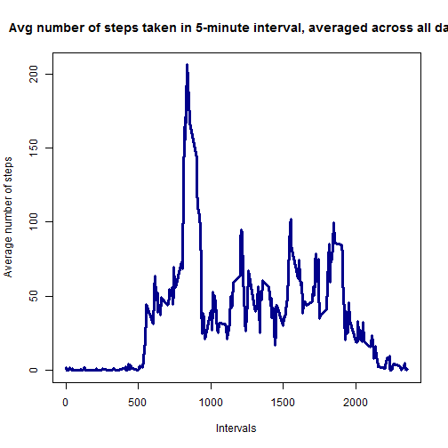
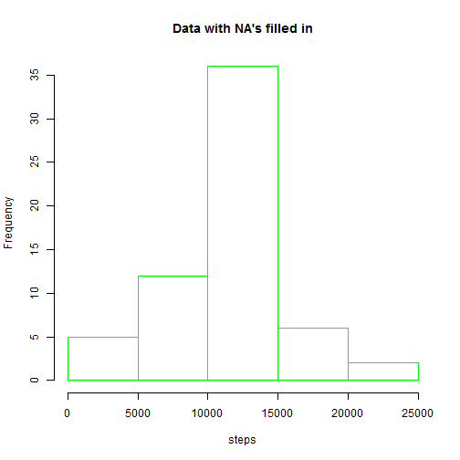
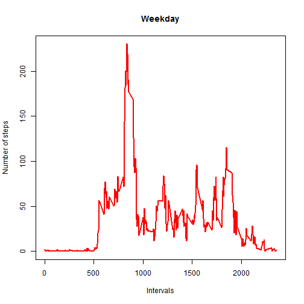
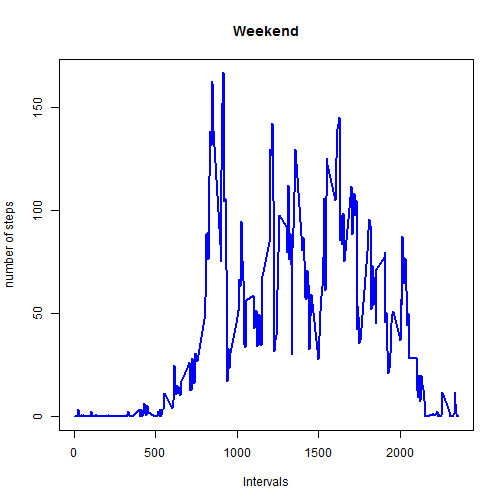

This is an R Markdown document. Markdown is a simple formatting syntax for authoring HTML, PDF, and MS Word documents. For more details on using R Markdown see <http://rmarkdown.rstudio.com>.

When you click the **Knit** button a document will be generated that includes both content as well as the output of any embedded R code chunks within the document. You can embed an R code chunk like this:

```r
rm(list=ls())
library(dplyr)
```


**Now Lets download the data and understand what is in it there**

```r
activityData <- read.csv(file="activity.csv",sep=",",header=TRUE)
names(activityData)
```

```
## [1] "steps"    "date"     "interval"
```

```r
dim(activityData)
```

```
## [1] 17568     3
```
**Now Lets Transform the data into Suitable format for analysis**

```r
activityData <- mutate(activityData, hour = interval %/% 100, minute = interval %% 100)
```
**Calculating the Total number of steps taken daily**

```r
daily<-c()  # This will be the total number of steps taken per day


for (i in 1:61){ # total number of days in October and November is 31+30=61
    start<-(i-1)*288+1  # 288 five-minute steps in a day; 24*60/5=288
    last<-(i-1)*288+288
    temp<-activityData[start:last,1]    # extracting all 5-minute steps for each day
    daily<-c(daily,sum(temp))   # concatenating the daily totals  
}
##aggsteps1 <- aggregate(activityData$steps, by=list(activityData$date),FUN=sum)
##aggsteps1_noNA <- data.frame(na.omit(aggsteps1))
```
**Now make a Histogram of the total number of steps taken each day**

```r
daily_noNA<-daily[!is.na(daily)]  # NA's are removed

hist(daily_noNA, xlab="steps",ylab="Frequency",main="Histogram of the total number of steps taken each day")
```

 


**Calculating and reporting the Mean total number of steps taken per day**

```r
mean(daily,na.rm=T)
```

```
## [1] 10766.19
```
**Median total number of steps taken per day**

```r
median(daily,na.rm=T)
```

```
## [1] 10765
```
**Now, What is the average Daily Pattern**
*The Question at Hand for us: Make a time series plot (i.e. type = "l") of the 5-minute interval (x-axis) and the average number of steps taken, averaged across all days (y-axis)*

```r
x <- activityData[,1]         # number of steps in 5-minute intevals
numberOfStepsin5MinIntervals<-matrix(x,288,61) # so as to get average of 5-minute intevals across all days There are 288 5 minute intervals in a day  

five_average<-apply(numberOfStepsin5MinIntervals,1,mean,na.rm=TRUE)  # 5-minute interval average number of steps taken, 
# averaged across all days

plot(activityData$interval[1:288],five_average, type='l',col='darkblue',
     xlab='Intervals',lwd=3,
     ylab='Average number of steps',
     main ='Avg number of steps taken in 5-minute interval, averaged across all days')
```

 


*Part 2 is Which 5-minute interval, on average across all the days in the dataset, contains the maximum number of steps?*

```r
hr<-activityData$hour[1:288]
min<-activityData$minute[1:288]

hr_max<-hr[which(five_average==max(five_average))]
min_max<-min[which(five_average==max(five_average))]

cat('The maximum number of steps occurs at',hr_max,':',min_max,'AM')
```

```
## The maximum number of steps occurs at 8 : 35 AM
```
**Imputing missing Values**
*Question 1 Calculate and report the total number of missing values in the dataset (i.e. the total number of rows with NAs)*
*The total number of missing values is:*

```r
sum(is.na(activityData[,1]))
```

```
## [1] 2304
```
*Question 2 Devise a strategy for filling in all of the missing values in the dataset. The strategy does not need to be sophisticated. For example, you could use the mean/median for that day, or the mean for that 5-minute interval, etc.*

```r
# five_average is the 5-minute average across all days as shown in plotting the histogram above
# Let us replicate the 5-minute interval average over the number of days

five_average_rep<- rep(five_average,61)

activityData1<-activityData   # creating a copy of the datset so as to keep the original data intact

for (i in 1:length(activityData1[,1])){  # there are 61 days
    
    if(is.na(activityData1[i,1])==TRUE){
        activityData1[i,1]= five_average_rep[i]  # Finding NA and replacing the missing values with 5-min averages
    }}
```
*QUestion 3, Create a new dataset that is equal to the original dataset but with the missing data filled in*
*Answer for Question 3 is activityData1 is the new data set asked for in the above question*

*Question 4 Make a histogram of the total number of steps taken each day and Calculate and report the mean and median total number of steps taken per day.*


```r
daily1<-c()


for (i in 1:61){              #  the total number of days in October and November is 31+30=61
    start<-(i-1)*288+1        #  there are 288 five-minute steps in a day; 24*60/5=288
    last<-(i-1)*288+288
    temp<-activityData1[start:last,1]    # extracting all 5-minute steps for each day
    daily1<-c(daily1,sum(temp))   # concatenating the daily totals 
}
hist(daily1, xlab="steps",ylab="Frequency", axes=TRUE,main="Data with NA's filled in",border='green')
```

 

```r
hist(daily_noNA, xlab="steps",ylab="Frequency",axes=TRUE,main="NA's not filled in",border='purple')
```

 


```r
# The mean of  total number of steps taken per day is:
mean(daily1)
```

```
## [1] 10766.19
```

```r
# The median of  total number of steps taken per day is:
median(daily1)
```

```
## [1] 10766.19
```
*Do these values differ from the estimates from the first part of the assignment? What is the impact of imputing missing data on the estimates of the total daily number of steps?*
*Yes they show differences in the Median and in histograms. imputing missing data on the estimates of the total daily number of steps changes the median, and the distribution as as can be seen from the histograms*

**Lastly, Are there differences in activity patterns between weekdays and weekends?**
*Create a new factor variable in the dataset with two levels - "weekday" and "weekend" indicating whether a given date is a weekday or weekend day.*

```r
activityData1$date<-as.Date(activityData1$date)
activityData1$day<-weekdays(activityData1$date)
activityData1_weekdays<-activityData1[(!activityData1$day %in% c("Saturday","Sunday")),]  # weekdays
activityData1_weekend<-activityData1[(activityData1$day %in% c("Saturday","Sunday")),]   #  weekend
weekday_steps<-activityData1_weekdays[,1]
temp<-matrix(weekday_steps,nrow=288)
weekday_steps_average<-apply(temp,1,mean)
weekend_steps<-activityData1_weekend[,1]
temp<-matrix(weekend_steps,nrow=288)
weekend_steps_average<-apply(temp,1,mean)
```
*Make a panel plot containing a time series plot (i.e. type = "l") of the 5-minute interval (x-axis) and the average number of steps taken, averaged across all weekday days or weekend days (y-axis)*

```r
plot(activityData$interval[1:288],weekday_steps_average, type="l",xlab='Intervals',ylab="Number of steps",
     col='red',lwd=2, main="Weekday")
```

 

```r
plot(activityData$interval[1:288],weekend_steps_average, type="l", xlab='Intervals',ylab="number of steps",
     col='blue',lwd=2,main="Weekend")
```

 
